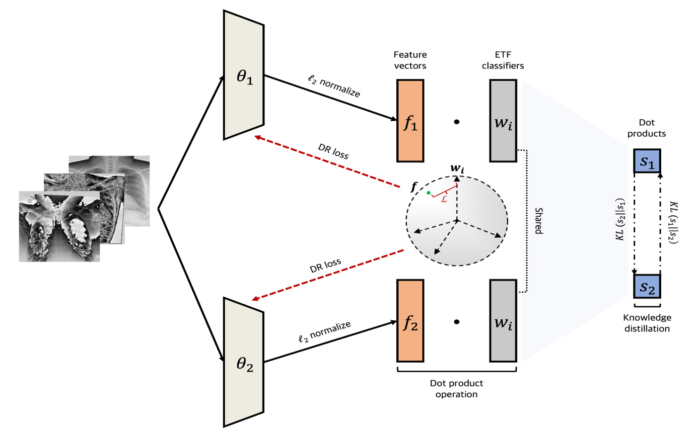

# 📌 Robust Medical Image Model Against Data Contamination
**Yonsei University Digital Healthcare Cybersecurity Competition - 2nd Place Winner 🏆**

## 🏥 Project Overview
Medical image contamination is a critical issue in AI-based healthcare applications. Contaminated images can significantly degrade model performance, leading to incorrect diagnoses and treatment decisions. This project focuses on developing a **robust AI model** that can:
1. **Classify chest X-ray images** into normal and disease categories, including detailed subcategories.
2. **Detect contaminated images** within the dataset, distinguishing between different contamination types.

---

## 📂 Dataset
We utilized a dataset of **5,000 chest X-ray images** with various contamination types:
- **Noise Addition**: Random noise artifacts affecting image quality.
- **Label Errors**: Mislabeling of medical images, causing model confusion.
- **Poison Attacks**: Intentional data corruption designed to degrade model performance.

## 🔬 Methodology
### **1️⃣ Model Architecture**
To enhance the robustness of the AI model, we implemented the following techniques:
- **ETF Classifier**: Ensures a more separable feature space by enforcing equiangular tight frame properties.
- **RECT (Rectification Strategy)**: Adjusts vector magnitudes to address class imbalance.
- **Deep Mutual Learning (DML)**: Improves generalization through knowledge distillation between two models.

📌 **Architecture Overview**  


---

### **2️⃣ Training Process**
- **Data Split**: 70% Train / 20% Validation / 10% Test
- **Optimizer**: Adam (LR: `0.0001`, Weight Decay: `0.001`)
- **Early Stopping**: Patience = `20`
- **Scheduler**: ReduceLROnPlateau
- **Experimental Scenarios**:
  - **Exp 1**: Training on the original dataset.
  - **Exp 2**: Training on clean data, but testing with Gaussian noise-added data.

---

## 📊 Results
Our proposed model outperformed the baseline in all major evaluation metrics.

### **1️⃣ Classification Performance**
| Model | Accuracy | F1 Score | Precision |
|--------|------------|-----------|------------|
| ResNet-50 (Baseline) | 38.4% | 31.4% | 28.8% |
| ResNet-50 + ETF | 44.3% | 36.5% | 35.7% |
| ResNet-50 + ETF + RECT | 46.3% | 39.9% | 42.0% |
| **ResNet-50 + ETF + RECT + DML (Ours)** | **46.7%** | **44.9%** | **46.9%** |

### **2️⃣ Robustness Against Poison Attacks**
| Model | Accuracy Drop | F1 Score Drop | Precision Drop |
|--------|----------------|--------------|--------------|
| ResNet-50 (Baseline) | 12.56% | 37.5% | 14.3% |
| ResNet-50 + ETF | 9.72% | 29.12% | 8.5% |
| ResNet-50 + ETF + RECT | 9.51% | 28.29% | 10.6% |
| **ResNet-50 + ETF + RECT + DML (Ours)** | **10.93%** | **32.55%** | **7.3%** |

📌 **Performance Drop Evaluation Method**  
We introduce a **Combined Performance Drop Metric**, which measures robustness by comparing performance degradation between clean and attacked datasets.

Drop_M = (M_normal - M_attack) / M_normal * 100


---

## 🎯 Key Contributions
✅ **First application of ETF Classifier & RECT in medical image classification**  
✅ **First use of Collaborative Learning for Poison Attack defense in medical imaging**  
✅ **New robustness evaluation metric for better contamination resilience assessment**  

---

### **1️⃣ Clone the Repository**
Clone the repository and navigate to the project directory:

```bash
git clone https://github.com/minkyoon/2024_Poisoned_Medical_Image_Defense.git
cd 2024_Poisoned_Medical_Image_Defense
```

### **2️⃣ Install Dependencies**
Install the required Python packages:

```bash
pip install -r requirements.txt
```

### **3️⃣ Train the Model**
Run the training script:

```bash
python train.py
```

### **4️⃣ Evaluate on Test Data**
Evaluate the trained model:

```bash
python evaluate.py
```

---

## 🤝 Acknowledgments
This work was developed as part of the **Yonsei Digital Healthcare Cybersecurity Competition 2024**, where our team won **2nd place**.  
Special thanks to my teammates and the organizing committee for their support and collaboration.

